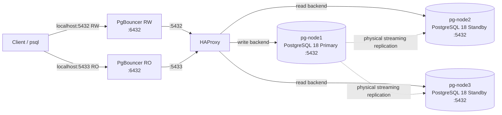

# PostgreSQL 18 Replication, Routing & Connection Pooling Lab

A portfolio-grade local lab that demonstrates a small PostgreSQL platform built from first principles with **PostgreSQL 18**, **physical streaming replication**, **HAProxy**, **PgBouncer**, **Docker Compose**, and **Docker secrets**.

The project exposes separate client endpoints for read/write and read-only traffic while keeping PostgreSQL itself private to the Docker network.

> **Scope:** this is an educational architecture lab, not a production HA solution. Replication is automatic; **primary promotion and topology reconfiguration are intentionally not automated**. See [Architecture & design decisions](docs/ARCHITECTURE.md).

The current topology contains three role-neutral PostgreSQL services: **`pg-node1` is the primary**, while **`pg-node2` and `pg-node3` are asynchronous streaming standbys**. The neutral node names are intentional so that a later Patroni iteration can make database roles dynamic without renaming hosts.

## What this project demonstrates

- PostgreSQL 18 three-node deployment on Debian: one primary and two streaming standbys
- Physical streaming replication using `pg_basebackup`
- `standby.signal` / `primary_conninfo` generated by `pg_basebackup -R`
- HAProxy TCP routing with PostgreSQL health checks
- Dedicated **RW** and **RO** client paths
- PgBouncer transaction pooling
- SCRAM-SHA-256 client authentication
- Docker secrets instead of committed passwords
- Health checks, persistent volumes and dependency ordering
- Repeatable validation of role, replication and routing state

## Architecture



| Host endpoint | Path | Intended use |
|---|---|---|
| `127.0.0.1:5432` | PgBouncer RW → HAProxy `:5432` → primary | Read/write |
| `127.0.0.1:5433` | PgBouncer RO → HAProxy `:5433` → `pg-node2` / `pg-node3` | Read-only (HAProxy balances across standbys) |
| `127.0.0.1:8404/stats` | HAProxy statistics page | Lab monitoring |

## Prerequisites

- Docker Engine with Docker Compose v2
- `psql` client on the host for `scripts/verify.sh`
- `openssl` for automatic secret generation
- Optional: `make` and `shellcheck`

Verify:

```bash
docker --version
docker compose version
psql --version
```

## Quick start

```bash
git clone https://github.com/andrasfeher/postgresql-replication-routing-lab.git
cd postgresql-replication-routing-lab

make secrets
make up
```

Without `make`:

```bash
./scripts/init-secrets.sh
docker compose up -d --build
```

Wait until the containers are healthy:

```bash
docker compose ps
```

Then run the end-to-end verification:

```bash
make verify
```

## Connect

The generated PostgreSQL password is stored locally in `secrets/postgres_password.txt` and is excluded from Git.

```bash
export PGPASSWORD="$(cat secrets/postgres_password.txt)"

# Read/write endpoint -> primary
psql -h 127.0.0.1 -p 5432 -U postgres -d postgres

# Read-only endpoint -> standby
psql -h 127.0.0.1 -p 5433 -U postgres -d postgres
```

Confirm the target role:

```sql
SELECT pg_is_in_recovery();
```

Expected result:

- port `5432`: `false` — primary
- port `5433`: `true` — standby

## Verify streaming replication

On the primary:

```bash
docker compose exec pg-node1 \
  runuser -u postgres -- psql -c \
  "SELECT application_name, client_addr, state, sync_state FROM pg_stat_replication;"
```

Create a simple test object through the RW endpoint:

```bash
psql -h 127.0.0.1 -p 5432 -U postgres -d postgres <<'SQL'
CREATE TABLE IF NOT EXISTS lab_replication_test (
    id bigint GENERATED ALWAYS AS IDENTITY PRIMARY KEY,
    created_at timestamptz NOT NULL DEFAULT now(),
    note text NOT NULL
);
INSERT INTO lab_replication_test(note) VALUES ('written through the RW endpoint');
SQL
```

Read it through the RO endpoint:

```bash
psql -h 127.0.0.1 -p 5433 -U postgres -d postgres \
  -c "TABLE lab_replication_test;"
```

## PgBouncer monitoring

```bash
psql -h 127.0.0.1 -p 5432 -U postgres -d pgbouncer -c "SHOW POOLS;"
psql -h 127.0.0.1 -p 5432 -U postgres -d pgbouncer -c "SHOW STATS;"
```

The pool mode is `transaction`, so session-scoped PostgreSQL features must be evaluated carefully before using this configuration for an application.

## HAProxy monitoring

Open the local statistics page:

```text
http://127.0.0.1:8404/stats
```

The stats listener is deliberately bound to localhost by Docker Compose.

## Stop or reset

Stop containers but keep PostgreSQL data/configuration:

```bash
make down
```

Delete the containers **and all PostgreSQL lab data**:

```bash
make reset
```

## Repository layout

```text
.
├── .github/workflows/ci.yml
├── Dockerfile
├── Makefile
├── compose.yaml
├── docs/
│   ├── ARCHITECTURE.md
│   ├── PORTFOLIO.md
│   └── TROUBLESHOOTING.md
├── haproxy/
│   └── haproxy.cfg
├── pgbouncer/
│   ├── entrypoint.sh
│   ├── pgbouncer-ro.ini
│   └── pgbouncer-rw.ini
├── scripts/
│   ├── check.sh
│   ├── init-secrets.sh
│   ├── primary-entrypoint.sh
│   ├── secondary-entrypoint.sh
│   └── verify.sh
└── secrets/
    ├── postgres_password.example
    └── replication_password.example
```

## Design notes and limitations

The PostgreSQL nodes use role-neutral service names (`pg-node1`, `pg-node2`, and `pg-node3`), but their roles are currently assigned statically: `pg-node1` is the primary, while `pg-node2` and `pg-node3` are standbys. HAProxy therefore routes the RW path to `pg-node1` and balances the RO path across `pg-node2` and `pg-node3`.

The deliberately important limitation is that HAProxy performs availability checks but does not discover PostgreSQL roles or promote a standby. The project therefore demonstrates **three-node streaming replication, routing and pooling**, but it does not pretend that routing alone provides automatic failover. If the primary fails, promotion and HAProxy topology changes are still manual.

A planned next iteration can introduce Patroni with a consensus-backed distributed configuration store. Patroni would then own PostgreSQL initialization, replication lifecycle, leader election and promotion, while HAProxy could discover the current primary and replicas dynamically through Patroni's role-aware health endpoints.

For the reasoning behind the topology and its trade-offs, read [docs/ARCHITECTURE.md](docs/ARCHITECTURE.md).

## Security

This repository is designed for a **local lab**:

- database and stats ports are bound to `127.0.0.1` by default;
- passwords are Docker secrets stored in ignored local files;
- generated PgBouncer authentication data is created inside the container at startup;
- no real credentials should ever be committed.

See [SECURITY.md](SECURITY.md) before exposing any component outside your workstation.
