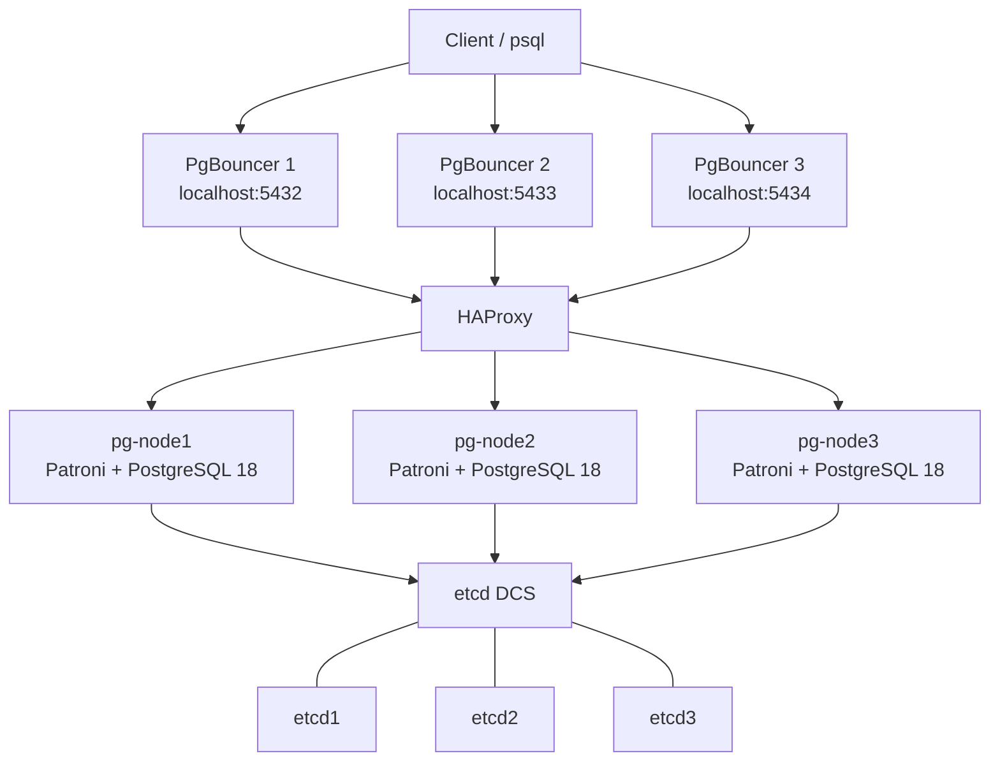

# PostgreSQL 18 HA, Replication, Routing & Connection Pooling Lab

A portfolio-grade local lab for building a small PostgreSQL high-availability platform from first principles with **PostgreSQL 18**, **Patroni**, **etcd**, **physical streaming replication**, **HAProxy**, **PgBouncer**, **Docker Compose**, and **Docker secrets**.

The project exposes separate client endpoints for read/write and read-only traffic while keeping PostgreSQL itself private to the Docker network.

> **Current development stage:** the original three-node primary/standby lab is being converted to Patroni-managed high availability. Patroni owns PostgreSQL initialization, replication lifecycle, role management, leader election, and promotion. A three-member etcd cluster provides the distributed configuration store (DCS).

The topology contains three role-neutral PostgreSQL services: **`pg-node1`**, **`pg-node2`**, and **`pg-node3`**. Patroni makes their database roles dynamic, so a node name identifies a host rather than permanently identifying a primary or replica.

## What this project demonstrates

- PostgreSQL 18 on Debian with three role-neutral database nodes
- Patroni-managed PostgreSQL initialization, replication lifecycle, leader election and promotion
- Three-member etcd v3 distributed configuration store
- Physical streaming replication between PostgreSQL members
- Patroni REST API health and role discovery
- HAProxy routing designed around Patroni role-aware health checks
- PgBouncer transaction pooling
- SCRAM-SHA-256 authentication
- Docker secrets instead of committed passwords
- Persistent PostgreSQL and etcd data volumes
- Docker health checks and dependency ordering
- Repeatable failover and recovery experiments

## Architecture



PostgreSQL node names are deliberately **role-neutral**. Patroni determines which member is primary and which members are replicas. HAProxy can query Patroni's REST API on port `8008` to route new connections according to the current role.

### Component responsibilities

| Component | Responsibility |
|---|---|
| PostgreSQL 18 | Database engine, WAL generation and physical streaming replication |
| Patroni | PostgreSQL lifecycle, cluster membership, leader election, promotion and role management |
| etcd | Consensus-backed distributed configuration store used by Patroni |
| HAProxy | Routes database connections according to backend health and Patroni role |
| PgBouncer | Client connection pooling |
| Docker Compose | Container, network, volume, secret and dependency orchestration |

A key design principle is separation of responsibilities: **PgBouncer manages connections, HAProxy routes traffic, Patroni manages PostgreSQL roles, and etcd provides consensus state.**

## Prerequisites

- Docker Engine with Docker Compose v2
- `psql` client on the host for `scripts/verify.sh`
- `openssl` for automatic secret generation
- Optional: `make` and `shellcheck`

Verify:

```bash
docker --version
docker compose version
psql --version
```

## Quick start

```bash
git clone https://github.com/andrasfeher/postgresql-replication-routing-lab.git
cd postgresql-replication-routing-lab

make secrets
make up
```

Without `make`:

```bash
./scripts/init-secrets.sh
docker compose up -d --build
```

Wait until the containers are healthy:

```bash
docker compose ps
```

Then run the end-to-end verification:

```bash
make verify
```

## Connect

The generated PostgreSQL password is stored locally in `secrets/postgres_password.txt` and is excluded from Git.

```bash
export PGPASSWORD="$(cat secrets/postgres_password.txt)"

# Read/write endpoint -> primary
psql -h 127.0.0.1 -p 5432 -U postgres -d postgres

# Read-only endpoint -> standby
psql -h 127.0.0.1 -p 5433 -U postgres -d postgres
```

Confirm the target role:

```sql
SELECT pg_is_in_recovery();
```

Expected result:

- port `5432`: `false` — primary
- port `5433`: `true` — standby

## Patroni and role verification

Each node receives a node-specific configuration from `patroni/`, mounted as `/etc/patroni/patroni.yml`. Passwords remain outside Git and are passed from Docker secrets by `scripts/patroni-entrypoint.sh`.

Inspect cluster membership and roles with:

```bash
docker exec -it pg-node1 \
  patronictl -c /etc/patroni/patroni.yml list
```

Do not assume `pg-node1` will always be primary. To inspect a node directly:

```bash
docker exec -it pg-node1 \
  runuser -u postgres -- \
  psql -c "SELECT pg_is_in_recovery();"
```

`false` means primary; `true` means replica.

## Verify streaming replication

On whichever node Patroni currently reports as primary:

```sql
SELECT application_name, client_addr, state, sync_state
FROM pg_stat_replication;
```

With two healthy asynchronous replicas, the primary should normally report two streaming replication connections.

Create a simple test object through the RW endpoint:

```bash
psql -h 127.0.0.1 -p 5432 -U postgres -d postgres <<'SQL'
CREATE TABLE IF NOT EXISTS lab_replication_test (
    id bigint GENERATED ALWAYS AS IDENTITY PRIMARY KEY,
    created_at timestamptz NOT NULL DEFAULT now(),
    note text NOT NULL
);
INSERT INTO lab_replication_test(note) VALUES ('written through the RW endpoint');
SQL
```

Read it through the RO endpoint:

```bash
psql -h 127.0.0.1 -p 5433 -U postgres -d postgres \
  -c "TABLE lab_replication_test;"
```

## PgBouncer monitoring

```bash
psql -h 127.0.0.1 -p 5432 -U postgres -d pgbouncer -c "SHOW POOLS;"
psql -h 127.0.0.1 -p 5432 -U postgres -d pgbouncer -c "SHOW STATS;"
```

The pool mode is `transaction`, so session-scoped PostgreSQL features must be evaluated carefully before using this configuration for an application.

## HAProxy monitoring

Open the local statistics page:

```text
http://127.0.0.1:8404/stats
```

The stats listener is deliberately bound to localhost by Docker Compose.

## Stop or reset

Stop containers but keep PostgreSQL data/configuration:

```bash
make down
```

Delete the containers **and all PostgreSQL lab data**:

```bash
make reset
```

## Repository layout

```text
.
├── .github/workflows/ci.yml
├── Dockerfile
├── Makefile
├── compose.yaml
├── docs/
│   ├── ARCHITECTURE.md
│   ├── PORTFOLIO.md
│   └── TROUBLESHOOTING.md
├── haproxy/
│   └── haproxy.cfg
├── patroni/
│   ├── patroni-node1.yml
│   ├── patroni-node2.yml
│   └── patroni-node3.yml
├── pgbouncer/
│   ├── entrypoint.sh
│   ├── pgbouncer-1.ini
│   ├── pgbouncer-2.ini
│   └── pgbouncer-3.ini
├── scripts/
│   ├── check.sh
│   ├── init-secrets.sh
│   ├── patroni-entrypoint.sh
│   └── verify.sh
└── secrets/
    ├── postgres_password.example
    └── replication_password.example
```

## Design notes and limitations

The original lab assigned roles statically: `pg-node1` was primary and `pg-node2`/`pg-node3` were standbys. The Patroni iteration removes that assumption. Patroni owns PostgreSQL initialization, replica cloning, start/stop operations, leader election and promotion.

HAProxy should use Patroni's role-aware REST endpoints rather than static node roles:

```text
RW backend -> Patroni /primary -> current primary
RO backend -> Patroni /replica -> healthy replicas
```

HAProxy does **not** elect or promote a primary; it reacts to the state managed by Patroni and etcd.

This remains an educational architecture lab rather than a drop-in production HA platform. Important limitations and learning points include asynchronous replication's potential data-loss window, application reconnect/retry requirements during failover, etcd quorum as part of the availability model, PgBouncer transaction-pooling semantics, and the absence of production fencing/watchdog design.

For the reasoning behind the topology and its trade-offs, read [docs/ARCHITECTURE.md](docs/ARCHITECTURE.md).

## Patroni failover exercises

Once the Patroni conversion is operational:

1. verify one primary and two replicas with `patronictl`;
2. stop the current primary and observe Patroni leader election;
3. verify HAProxy routes new RW connections to the promoted node;
4. restart the old primary and observe it rejoin as a replica;
5. stop one etcd member and confirm the DCS retains quorum;
6. test client and in-flight transaction behavior during failover;
7. measure failover time and document the observed RTO and RPO implications.

## Security

This repository is designed for a **local lab**:

- database and stats ports are bound to `127.0.0.1` by default;
- PostgreSQL and replication passwords are Docker secrets stored in ignored local files;
- Patroni configuration files contain no real passwords;
- generated PgBouncer authentication data is created inside the container at startup;
- no real credentials should ever be committed.

See [SECURITY.md](SECURITY.md) before exposing any component outside your workstation.
